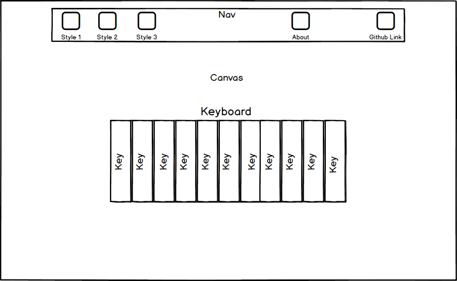

## ChromeTunes

### Background

ChromeTunes is an interactive javascript app that lets you create sounds via your keyboard and mouse and generates color visualizations as you play. ChromeTunes is inspired by the concept of Synesthesia, specifically Chromesthesia.

Synesthesia is a neurological phenomenon in which stimulation of one pathway associated with a sensory experience involuntarily triggers another sensory pathway. Chromesthesia is a specific type of Synesthesia in which hearing different sounds evokes experiences of color.

### Functionality & MVP

Chrometunes will allow users to be able to:

- [ ] Interact with a virtual keyboard to create sounds and color visualizations
- [ ] Select keys to play by pressing buttons on their keyboard.
- [ ] Paint a portion of the background with a different color depending on which key is pressed.
- [ ] Provide visual feedback on the keys when they are used.
- [ ] Choose from at least a few different sets of sounds via a toggle menu.

Additionally, ChromeTunes will include:

- [ ] A clickable modal to describe the inspiration and backgound of chiptunes and synesthesia
- [ ] A production README

### Wireframes

ChromeTunes will consist of a single screen with a keyboard, small nav above, and a default black background. The menu will contain a title, a toggle menu for different sets of sounds, a link to the github repo for the app.

### Architecture and Technologies

This project will be completed using the following Technologies:

- Vanilla Javascript for logic to play sounds and generate colors
- HTML with Canvas and CSS for DOM manipulation, rendering, and styling
- Webpack to bundle together various scripts necessary for the app to run

In addition to the webpack entry file, there will be three scripts associated with this app:

`keyboard.js`: this script will contain all the logic for creating the keyboard and its elements, which will be rendered to the dom.

`chrome_tunes.js`: this script will be the main entry file and will host all logic for creating the canvas, the listeners and corresponding functions.

`color.js`: this script will handle the logic for generating a color on the background image when a key is pressed

### Implementation Timeline

**Day 1**: Setup all necessary Node modules and configure webpack. Create `webpack.config.js` and `package.json` files. Write a basic entry file. Understand sound creation on Javascript. Pick out colors for each note. Goals for the day include:

- Complete webpack bundle
- Find colors for each corresponding note
- Research creating sound waves in Javascript
- Determine which scales/notes to map to keyboard

**Day 2**: This day will be dedicated to learning canvas, and using Canvas to generate animations. Additionally the sound functionality will be created so that keys will generate an appropriate sound. Goals for the day include:

- Generate a canvas
- Complete `sound.js` logic functionality
- Map each key to its appropriate sound and key-value on the computer keyboard
- Research Canvas functionality and animation

**Day 3**: This day will be dedicated to implementing the colors feature of the app in which a brush of color will be animated across the background and disappear momentarily using Canvas. Goals for the day include:

- Complete `color.js` logic functionality
- Map each key to its appropriate color

**Day 4**: This day will be dedicated to implementing the functionality and rendering of app navigation menu. Changing between different types of keyboard will be completed on this day as well as general styling and polish to the overall app. Goals for the day include:

- Render navigation menu
- Complete logic for switching between keyboard styles
- Complete Production README

### Bonus features

Given enough additional time. Some added features could include:

- [ ] Add Demo features that play simple songs
- [ ] Recording and playback features
- [ ] Layering of multiple recordings to create comprehensive music
